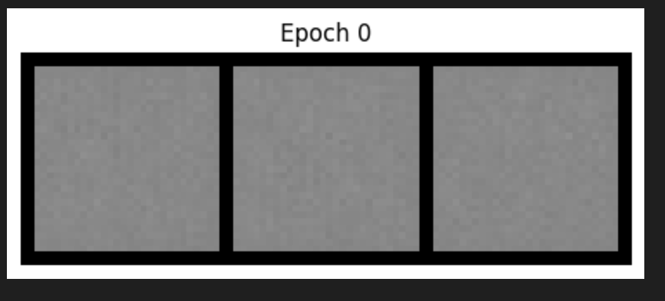
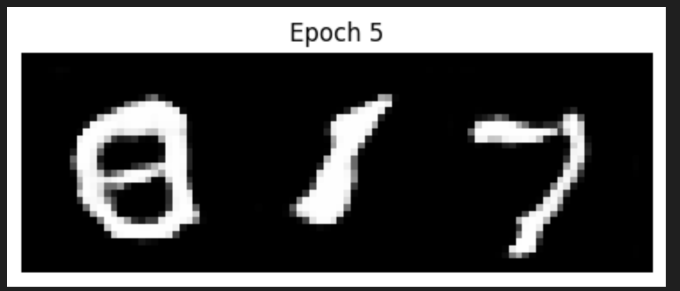
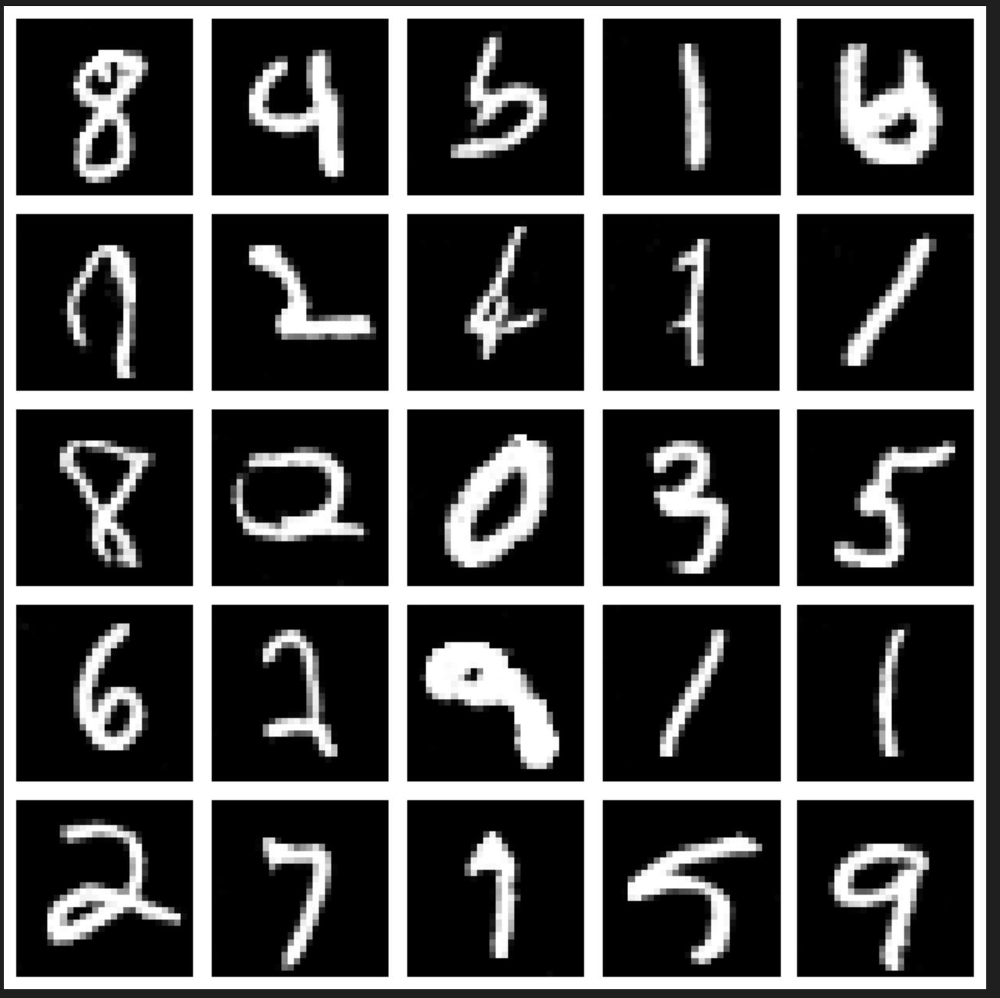
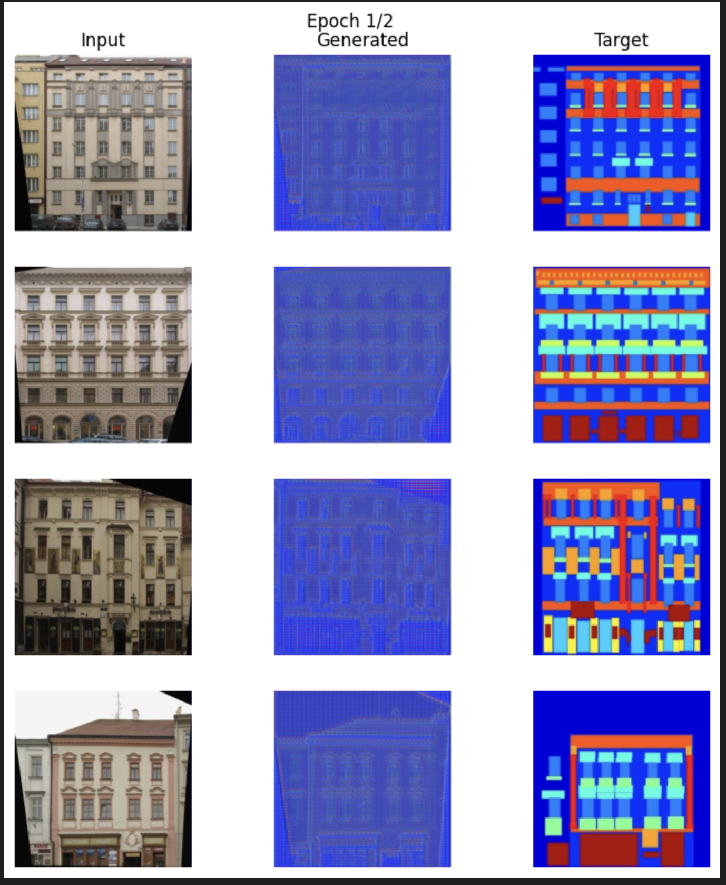
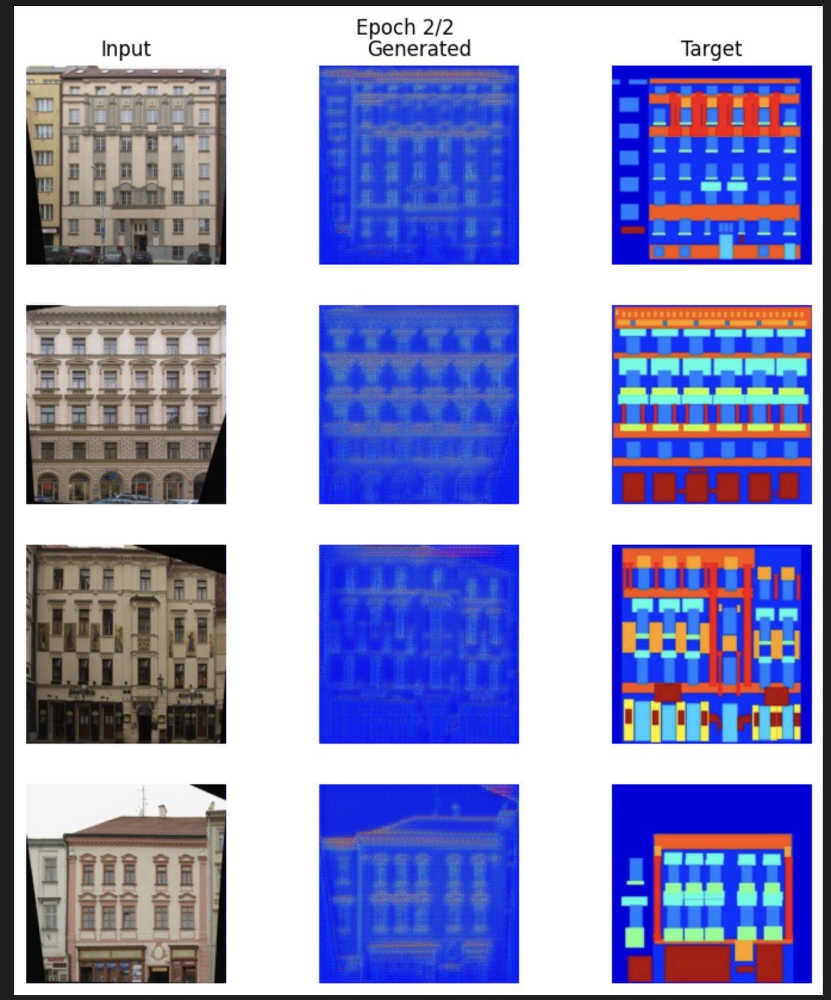

# GAN — DCGAN & Pix2Pix (PyTorch)

Three complete Generative Adversarial Network (GAN) implementations
explored progressively in PyTorch.

Starts from building a DCGAN from scratch and watching it learn to generate
handwritten digits, then loads a pretrained DCGAN to generate high-quality
images instantly, then implements a full Pix2Pix conditional GAN to translate
building photographs into architectural segmentation maps.

---

### What it does

- **Part 1 — DCGAN from scratch:** Builds Generator and Discriminator using
  transposed convolutions and trains on MNIST for 5 epochs. Visualises
  generated images at every epoch to show the GAN learning process.

- **Part 2 — Pretrained DCGAN:** Clones a pretrained DCGAN checkpoint trained
  for 99 epochs. Generates 25 high-quality digit images in a 5×5 grid instantly
  without any training.

- **Part 3 — Pix2Pix conditional GAN:** Trains a UNet Generator and PatchGAN
  Discriminator on the Berkeley Facades dataset to perform image-to-image
  translation — converting building facade photos into semantic segmentation maps.

---

### Datasets

| Part | Dataset | Source |
|---|---|---|
| Part 1 | MNIST | Auto-downloaded via torchvision |
| Part 2 | Pretrained weights (99 epochs) | [csinva/gan-vae-pretrained-pytorch](https://github.com/csinva/gan-vae-pretrained-pytorch) |
| Part 3 | Berkeley Facades | Auto-downloaded via wget from Berkeley |

---

### Part 1 — DCGAN Architecture

**Generator**
Noise vector z (dim = 100)
→ Linear(100 → 64 × 7 × 7) + reshape to (64, 7, 7)
→ ConvTranspose2d(64→32, 4×4, stride=2, pad=1) + BatchNorm + ReLU
[7×7 → 14×14]
→ ConvTranspose2d(32→1, 4×4, stride=2, pad=1) + Tanh
[14×14 → 28×28]
→ Final output: 28×28 grayscale image

**Discriminator**
Input: 28×28 grayscale image (flattened or conv)
→ Conv2d(1→64, 4×4, stride=2, pad=1) + LeakyReLU(0.2)
[28×28 → 14×14]
→ Conv2d(64→128, 4×4, stride=2, pad=1) + BatchNorm + LeakyReLU(0.2)
[14×14 → 7×7]
→ Flatten → Linear → Sigmoid
→ Output: Real (1) or Fake (0)

---

### Part 3 — Pix2Pix Architecture

**Generator — UNet with skip connections**
Encoder (UNetDown blocks):
Conv2d + BatchNorm + LeakyReLU (downsampling)
Decoder (UNetUp blocks):
ConvTranspose2d + BatchNorm + ReLU + skip connection from encoder
(skip connections preserve spatial detail lost during downsampling)
Output: Tanh → segmentation map

**Discriminator — PatchGAN**
Instead of classifying the full image as real or fake,
PatchGAN classifies overlapping 70×70 patches independently.
This forces the model to learn fine local texture and structure.

---

### Training Setup

**Part 1 — DCGAN**
Dataset       MNIST (60,000 images)
Epochs        5
Batch size    128
Latent dim    100
Image size    28×28
Loss          BCELoss (both G and D)
Optimizer     Adam (lr=0.0002, β1=0.5, β2=0.999)
Device        GPU if available, else CPU

**Part 3 — Pix2Pix**
Dataset       Berkeley Facades (train + val splits)
Epochs        2
Image size    256×256
Loss          BCEWithLogitsLoss + L1Loss (λ=100)
Optimizer     Adam (lr=0.0002, β1=0.5, β2=0.999)
Device        GPU if available, else CPU

---

### Training Progress — DCGAN

The GAN starts from pure random noise and learns the digit distribution:

**Epoch 0 — Generator output is pure noise:**



**Epoch 5 — Generator produces recognisable handwritten digits:**



---

### Pretrained DCGAN — 99 Epochs

Loading weights from a fully trained checkpoint produces
sharp, varied digit images with no training required:



---

### Pix2Pix Results

Each row shows: Input photo · Generated segmentation · Target segmentation

**After Epoch 1:**



**After Epoch 2:**



The Generator progressively improves at matching the target
segmentation structure — colour regions become more defined
as training continues.

---

### Stack

| | |
|---|---|
| **Framework** | PyTorch · torchvision |
| **Datasets** | MNIST · Berkeley Facades · Pretrained weights |
| **Visualization** | Matplotlib · tqdm |
| **Language** | Python |

---

### Setup

```bash
pip install torch torchvision matplotlib tqdm

jupyter notebook 5_GAN_demo.ipynb
```

All datasets and pretrained weights are downloaded automatically
inside the notebook — no manual setup needed.

---
